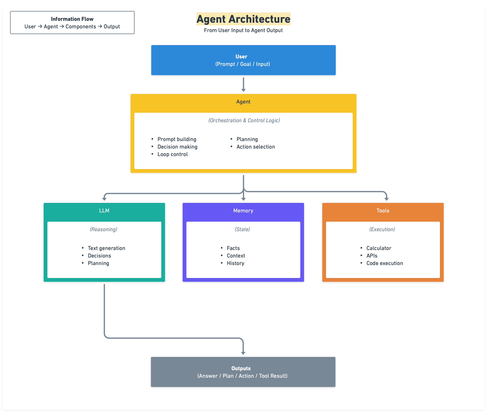

# AI Agents from Scratch

A gentle, local-first introduction to AI agents.

How AI agents actually work by building **one agent** step by step from a single local LLM call.



## Philosophy

Agents are not personalities. They are loops, state, and constraints.

## Quick Start
**For detailed setup instructions, see [QUICKSTART.md](QUICKSTART.md)**

In short:
1. Install dependencies: `pip install -r requirements.txt`
2. Download a GGUF model to the `models/` folder
3. Run: `python complete_example.py`

## Repository Structure

```
ai-agents-from-scratch/
├─ README.md              # You are here
├─ philosophy.md          # Why this repo exists
├─ QUICKSTART.md          # Detailed setup guide
├─ complete_example.py    # Demonstrations of all 12 lessons
├─ requirements.txt       # Python dependencies
│
├─ models/                # Place GGUF models here
├─ shared/                # Reusable utilities (LLM, prompts, utils)
├─ agent/                 # The evolving agent implementation
│  ├─ agent.py             # Main agent class 
│  ├─ memory.py            # Memory system
│  ├─ planner.py           # Planning and atomic actions
│  ├─ state.py             # Agent state management
│  ├─ tools.py             # Tool definitions
│  ├─ evals.py             # Evaluation framework (11)
│  └─ telemetry.py         # Telemetry system (12)
├─ evals/                 # Golden datasets for testing
│  └─ golden_datasets.py   # Known-good test cases
└─ /               # Step-by-step explanations (01-12)
```

### Key Files Explained

**`agent/agent.py`** - The heart of the repository
- Contains the `Agent` class that evolves across all 12 
- Each adds new methods and capabilities to this same class

**`complete_example.py`** - reference
- Contains 12 separate functions, one for each 
- Each function demonstrates that  concepts in isolation
- Use this to see how individual work before combining them
- Run: `python complete_example.py`

**`agent/evals.py`** - Regression testing ()
- Test your agent against known-good cases
- Catch prompt regressions before deployment

**`agent/telemetry.py`** - Runtime observability (12)
- Structured logging for debugging
- Track latency, success rates, and traces

**Relationship**: 
- `agent/agent.py` = the code you're (the implementation)
- `complete_example.py` = isolated examples of each  (for and experimentation)

## What This Repo Is Not

- This is **not a framework**
- This is **not a chatbot demo**
- This does **not claim models think**
- This does **not expose chain-of-thought**
- This does **not require OpenAI or cloud APIs**

## Core Principles

1. **One agent, many stages** - The same `agent.py` file grows across lessons
2. **Explicit over implicit** - No hidden logic, no magic abstractions
3. **Structure over prompting** - Reliability comes from constraints, not clever wording
4. **Local-first** - No API keys, no rate limits, no cloud dependency

## License
MIT License - see LICENSE file

